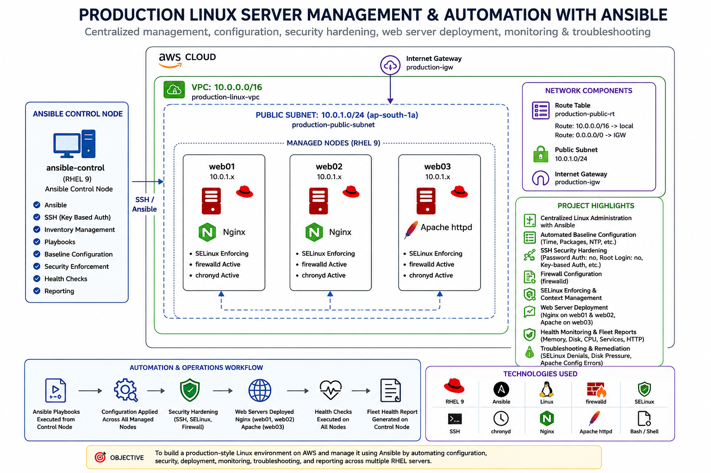

# Production-Ready Linux Server Management & Automation

## Overview

This project is a hands-on Linux server management and automation environment built using AWS EC2, RHEL 9, and Ansible.

The main idea is to manage multiple Linux servers from a single Ansible control node instead of configuring each server manually. I automated common administration tasks such as system baseline configuration, user management, SSH hardening, firewall configuration, SELinux management, and web server deployment.

I also built health checks to monitor important system resources and services, generate fleet health reports, and identify issues such as high disk usage. To make the project more realistic, I simulated problems such as disk pressure, SELinux access denials, and Apache configuration errors, then investigated and recovered from them.

Overall, this project helped me practice Linux administration, Ansible automation, security, troubleshooting, monitoring, and Git-based configuration management in a production-style environment.

---

## Architecture

```text
                         AWS CLOUD
                             │
                       Production VPC
                        10.0.0.0/16
                             │
                       Public Subnet
                        10.0.1.0/24
                             │
          ┌──────────────────┴──────────────────┐
          │                                     │
   Ansible Control Node                   RHEL 9 Fleet
          │                              ┌──────┼──────┐
          │                              │      │      │
          │                             web01  web02  web03
          │                             Nginx  Nginx  Apache
          │
          └──────────── SSH / Ansible ────────────────┘

                 CENTRALIZED AUTOMATION
                         │
       ┌─────────────────┼──────────────────┐
       │                 │                  │
 Configuration      Security &         Health &
 Management         Hardening          Monitoring
       │                 │                  │
       ├─ Services       ├─ SELinux       ├─ Memory
       ├─ Web servers    ├─ SSH           ├─ Disk
       ├─ Firewall       ├─ Firewall      ├─ HTTP
       └─ Time sync      └─ Validation    └─ Fleet report

```



