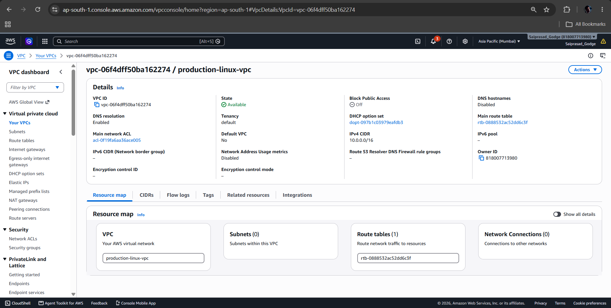
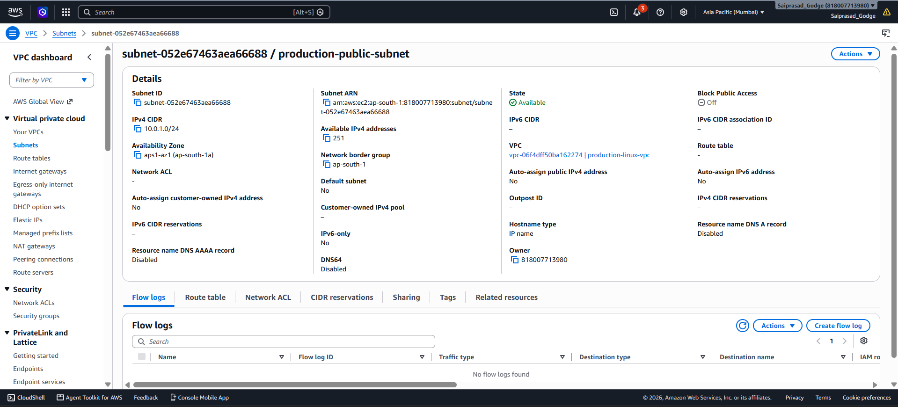
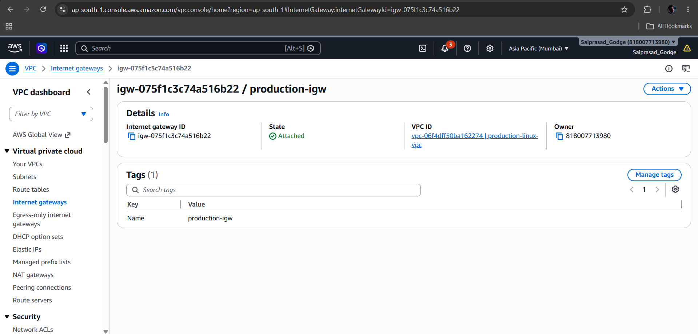
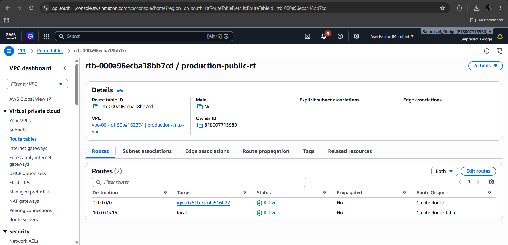
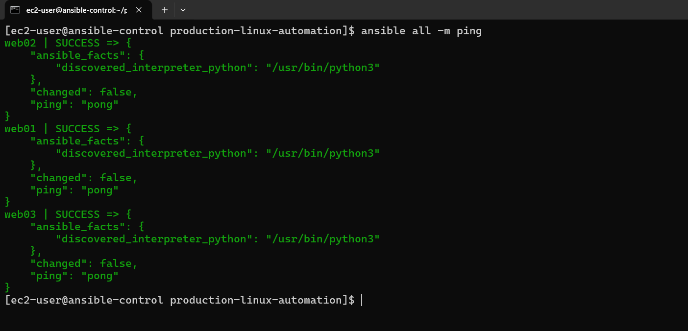

# Production-Ready Linux Server Management & Automation

## Overview

This project is a hands-on Linux server management and automation environment built using AWS EC2, RHEL 9, and Ansible.

The main idea is to manage multiple Linux servers from a single Ansible control node instead of configuring each server manually. I automated common administration tasks such as system baseline configuration, user management, SSH hardening, firewall configuration, SELinux management, and web server deployment.

I also built health checks to monitor important system resources and services, generate fleet health reports, and identify issues such as high disk usage. To make the project more realistic, I simulated problems such as disk pressure, SELinux access denials, and Apache configuration errors, then investigated and recovered from them.

Overall, this project helped me practice Linux administration, Ansible automation, security, troubleshooting, monitoring, and Git-based configuration management in a production-style environment.

---

## Architecture

```text
                         AWS CLOUD
                             │
                       Production VPC
                        10.0.0.0/16
                             │
                       Public Subnet
                        10.0.1.0/24
                             │
          ┌──────────────────┴──────────────────┐
          │                                     │
   Ansible Control Node                   RHEL 9 Fleet
          │                              ┌──────┼──────┐
          │                              │      │      │
          │                             web01  web02  web03
          │                             Nginx  Nginx  Apache
          │
          └──────────── SSH / Ansible ────────────────┘

                 CENTRALIZED AUTOMATION
                         │
       ┌─────────────────┼──────────────────┐
       │                 │                  │
 Configuration      Security &         Health &
 Management         Hardening          Monitoring
       │                 │                  │
       ├─ Services       ├─ SELinux       ├─ Memory
       ├─ Web servers    ├─ SSH           ├─ Disk
       ├─ Firewall       ├─ Firewall      ├─ HTTP
       └─ Time sync      └─ Validation    └─ Fleet report

```


```text
## Tech Stack

| Category | Technologies |
|---|---|
| Cloud Platform | AWS |
| Compute | Amazon EC2 |
| Operating System | Red Hat Enterprise Linux (RHEL) 9 |
| Automation & Configuration Management | Ansible |
| Remote Management | SSH |
| Web Servers | Nginx, Apache HTTP Server |
| Security | SELinux, firewalld, SSH hardening |
| Time Synchronization | chrony |
| Scripting & Administration | Bash / Linux Shell |
| Networking | VPC, Subnet, Internet Gateway, Route Table |
| Monitoring & Health Checks | Ansible-based health checks and fleet health reports |
| Version Control | Git, GitHub |
```
## Infrastructure Setup

The infrastructure for this project was created on AWS using a custom VPC, a public subnet, an Internet Gateway, and a dedicated route table. This network provides the environment in which the Ansible control node and RHEL servers are deployed and managed.

### AWS VPC

A custom VPC named `production-linux-vpc` was created in the AWS Mumbai (`ap-south-1`) region.

The VPC uses the IPv4 CIDR block `10.0.0.0/16`, providing a private address space for the project infrastructure.

**Configuration:**

- VPC Name: `production-linux-vpc`
- IPv4 CIDR: `10.0.0.0/16`
- Region: `ap-south-1` (Mumbai)
- Tenancy: Default
- DNS Resolution: Enabled




### Public Subnet

A public subnet named `production-public-subnet` was created inside the production VPC.

The subnet uses the CIDR block `10.0.1.0/24` and is located in Availability Zone `ap-south-1a`.

**Configuration:**

- Subnet Name: `production-public-subnet`
- IPv4 CIDR: `10.0.1.0/24`
- Availability Zone: `ap-south-1a`
- VPC: `production-linux-vpc`



### Internet Gateway

An Internet Gateway named `production-igw` was created and attached to the `production-linux-vpc`.

The Internet Gateway provides a path between the VPC and the internet for resources that have the appropriate routing and public network configuration.

**Configuration:**

- Internet Gateway: `production-igw`
- Status: Attached
- VPC: `production-linux-vpc`




### Route Table

A dedicated route table named `production-public-rt` was created for the public subnet.

The route table contains the default local VPC route and an internet route through the Internet Gateway.

**Routes:**

| Destination | Target |
|---|---|
| `10.0.0.0/16` | `local` |
| `0.0.0.0/0` | `production-igw` |

The `production-public-subnet` was explicitly associated with this route table, allowing resources in the subnet to use the configured routes.




## Ansible Configuration

Ansible is used as the central automation and configuration management tool for the Linux server fleet. The `ansible-control` node manages the three RHEL servers — `web01`, `web02`, and `web03` — through SSH.

### Inventory

The Ansible inventory defines the managed Linux servers and allows them to be addressed as a group.

The project uses the following hosts:

- `web01`
- `web02`
- `web03`

The control node uses this inventory to execute Ansible commands and automation tasks across the server fleet.

### Connectivity Validation

Before performing configuration and administration tasks, connectivity between the Ansible control node and all managed servers was validated using the Ansible `ping` module.

```bash
ansible all -m ping
```

