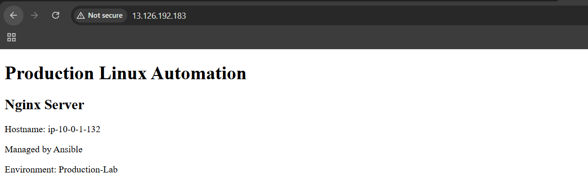
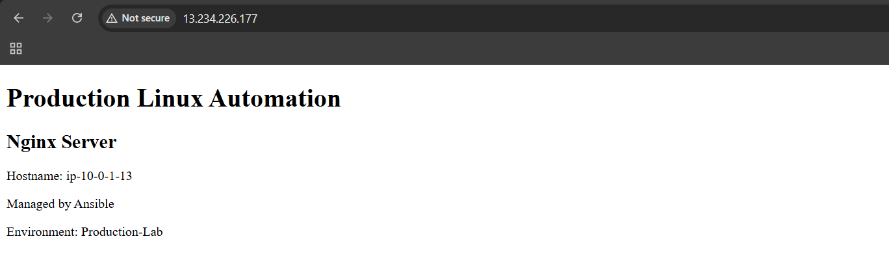
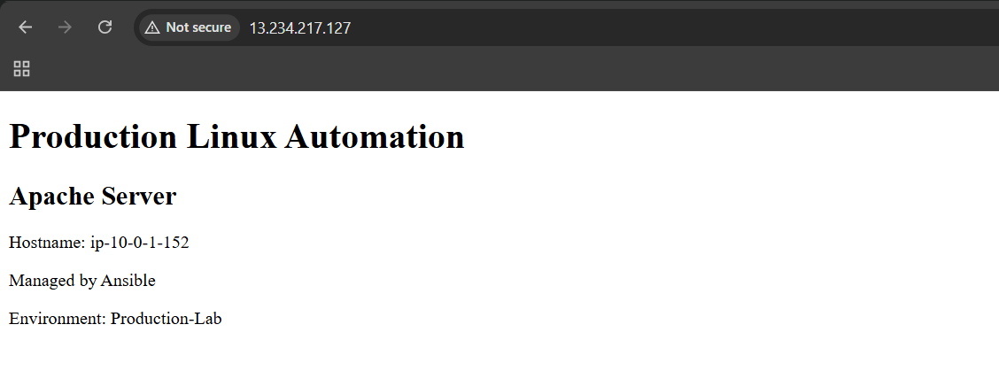
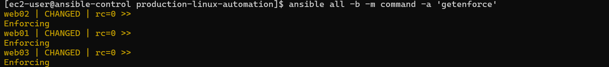
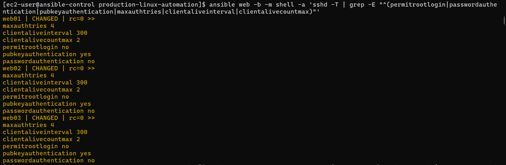
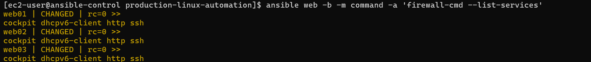

# Production-Ready Linux Server Management & Automation

## Overview

This project is a hands-on Linux server management and automation environment built using AWS EC2, RHEL 9, and Ansible.

The main idea is to manage multiple Linux servers from a single Ansible control node instead of configuring each server manually. I automated common administration tasks such as system baseline configuration, user management, SSH hardening, firewall configuration, SELinux management, and web server deployment.

I also built health checks to monitor important system resources and services, generate fleet health reports, and identify issues such as high disk usage. To make the project more realistic, I simulated problems such as disk pressure, SELinux access denials, and Apache configuration errors, then investigated and recovered from them.

Overall, this project helped me practice Linux administration, Ansible automation, security, troubleshooting, monitoring, and Git-based configuration management in a production-style environment.

---

## Architecture

```text
                         AWS CLOUD
                             │
                       Production VPC
                        10.0.0.0/16
                             │
                       Public Subnet
                        10.0.1.0/24
                             │
          ┌──────────────────┴──────────────────┐
          │                                     │
   Ansible Control Node                   RHEL 9 Fleet
          │                              ┌──────┼──────┐
          │                              │      │      │
          │                             web01  web02  web03
          │                             Nginx  Nginx  Apache
          │
          └──────────── SSH / Ansible ────────────────┘

                 CENTRALIZED AUTOMATION
                         │
       ┌─────────────────┼──────────────────┐
       │                 │                  │
 Configuration      Security &         Health &
 Management         Hardening          Monitoring
       │                 │                  │
       ├─ Services       ├─ SELinux       ├─ Memory
       ├─ Web servers    ├─ SSH           ├─ Disk
       ├─ Firewall       ├─ Firewall      ├─ HTTP
       └─ Time sync      └─ Validation    └─ Fleet report

```


## Tech Stack

| Category | Technologies |
|---|---|
| Cloud Platform | AWS |
| Compute | Amazon EC2 |
| Operating System | Red Hat Enterprise Linux (RHEL) 9 |
| Automation & Configuration Management | Ansible |
| Remote Management | SSH |
| Web Servers | Nginx, Apache HTTP Server |
| Security | SELinux, firewalld, SSH hardening |
| Time Synchronization | chrony |
| Scripting & Administration | Bash / Linux Shell |
| Networking | VPC, Subnet, Internet Gateway, Route Table |
| Monitoring & Health Checks | Ansible-based health checks and fleet health reports |
| Version Control | Git, GitHub |

## Infrastructure Setup

The infrastructure for this project was created on AWS using a custom VPC, a public subnet, an Internet Gateway, and a dedicated route table. This network provides the environment in which the Ansible control node and RHEL servers are deployed and managed.

### AWS VPC

A custom VPC named `production-linux-vpc` was created in the AWS Mumbai (`ap-south-1`) region.

The VPC uses the IPv4 CIDR block `10.0.0.0/16`, providing a private address space for the project infrastructure.

**Configuration:**

- VPC Name: `production-linux-vpc`
- IPv4 CIDR: `10.0.0.0/16`
- Region: `ap-south-1` (Mumbai)
- Tenancy: Default
- DNS Resolution: Enabled


### Public Subnet

A public subnet named `production-public-subnet` was created inside the production VPC.

The subnet uses the CIDR block `10.0.1.0/24` and is located in Availability Zone `ap-south-1a`.

**Configuration:**

- Subnet Name: `production-public-subnet`
- IPv4 CIDR: `10.0.1.0/24`
- Availability Zone: `ap-south-1a`
- VPC: `production-linux-vpc`


### Internet Gateway

An Internet Gateway named `production-igw` was created and attached to the `production-linux-vpc`.

The Internet Gateway provides a path between the VPC and the internet for resources that have the appropriate routing and public network configuration.

**Configuration:**

- Internet Gateway: `production-igw`
- Status: Attached
- VPC: `production-linux-vpc`


### Route Table

A dedicated route table named `production-public-rt` was created for the public subnet.

The route table contains the default local VPC route and an internet route through the Internet Gateway.

**Routes:**

| Destination | Target |
|---|---|
| `10.0.0.0/16` | `local` |
| `0.0.0.0/0` | `production-igw` |

The `production-public-subnet` was explicitly associated with this route table, allowing resources in the subnet to use the configured routes.


## Ansible Configuration

Ansible is used as the central automation and configuration management tool for the Linux server fleet. The `ansible-control` node manages the three RHEL servers — `web01`, `web02`, and `web03` — through SSH.

### Inventory

The Ansible inventory defines the managed Linux servers and allows them to be addressed as a group.

The project uses the following hosts:

- `web01`
- `web02`
- `web03`

The control node uses this inventory to execute Ansible commands and automation tasks across the server fleet.

### Connectivity Validation

Before performing configuration and administration tasks, connectivity between the Ansible control node and all managed servers was validated using the Ansible `ping` module.

```bash
ansible all -m ping
```


## Linux Baseline Configuration

A common Linux baseline was applied across the managed RHEL 9 servers using Ansible. The purpose of the baseline is to keep the servers consistent and ensure that important administration and security settings are configured in a repeatable way.

The baseline configuration includes:

- System timezone configuration
- Installation of required administration packages
- `chronyd` time synchronization
- `firewalld` configuration
- SELinux validation
- Standard system configuration

The baseline configuration is implemented in `playbooks/baseline.yml` and can be executed using:

```bash
ansible-playbook playbooks/baseline.yml
```

## Web Server Deployment

The project uses Ansible to deploy and manage web servers across the Linux fleet. Two different web servers were deployed to demonstrate how the same automation approach can manage different services on different hosts.

| Server | Host | Purpose |
|---|---|---|
| Nginx | `web01` | Web server |
| Nginx | `web02` | Web server |
| Apache HTTP Server | `web03` | Web server |

### Nginx

Nginx was deployed on `web01` and `web02` using an Ansible role.

The Nginx role manages:

- Nginx installation
- Nginx configuration
- Web application content
- Service state
- Configuration changes
- Service restart through Ansible handlers

The deployed web page contains the server hostname and indicates that the server is managed by Ansible.

#### web01



#### web02



The Nginx deployment was validated from the Ansible control node using an HTTP request:

```bash
ansible nginx -b -m shell -a 'curl -s http://localhost/'
```

### Apache

Apache HTTP Server was deployed on `web03` using a dedicated Ansible role.

The Apache role manages:

- Apache installation
- Apache configuration
- Web application content
- Service state
- Configuration validation
- Service restart through an Ansible handler

The Apache configuration was validated using:

```bash
ansible web03 -b -m command -a 'httpd -t'
```
The configuration returned:

```text
Syntax OK
```
The Apache service was then verified using:
```text
ansible web03 -b -m command -a 'systemctl is-active httpd'
```
The service returned:
```text
active
```
The deployed web application was tested using:
```text
ansible web03 -b -m shell -a 'curl -s http://localhost/'
```
The application successfully returned the Apache web page displaying the hostname and showing that the server is managed by Ansible.

#### web03



## Security Hardening

Security hardening was applied across the managed RHEL 9 servers using Ansible. The project focuses on three important areas of Linux server security: SELinux, SSH, and the host-based firewall.

### SELinux

SELinux was kept enabled in **Enforcing** mode across the managed servers.

The status was verified using:

```bash
ansible all -b -m command -a 'getenforce'
```



The managed servers returned:
```text
Enforcing
```
The project also configured the correct SELinux context for web content under /srv/webapp.

The web content uses the SELinux type:

```text
httpd_sys_content_t  
```

This allows the web servers to access the application content while SELinux continues to enforce access-control policies.

### SSH Hardening

SSH was hardened using Ansible to reduce unnecessary remote-access risks.

The configuration was validated for settings including:

```text
PermitRootLogin no
PasswordAuthentication no
PubkeyAuthentication yes
MaxAuthTries 4
ClientAliveInterval 300
ClientAliveCountMax 2
```

The configuration was checked using:

```text
ansible web -b -m shell -a 'sshd -T | grep -E "^(permitrootlogin|passwordauthentication|pubkeyauthentication|maxauthtries|clientaliveinterval|clientalivecountmax)"'
```



This configuration uses SSH key-based authentication, prevents direct root login, disables password-based SSH authentication, limits authentication attempts, and configures SSH session keepalive settings.

### Firewall

firewalld was configured and validated on the managed RHEL servers.

The firewall configuration was managed through Ansible and verified to be active.

The project allows the services required for administration and web-server operation, including SSH and HTTP.

```text
ansible web -b -m command -a 'firewall-cmd --list-services'
```



The firewall status was also checked as part of the automated health-check process.
